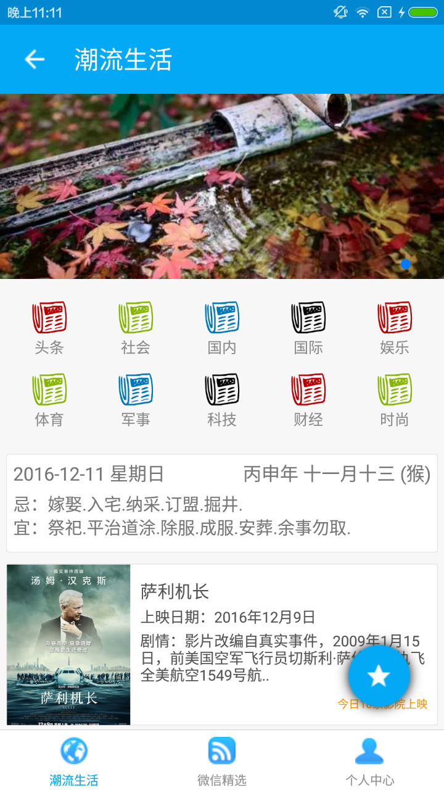
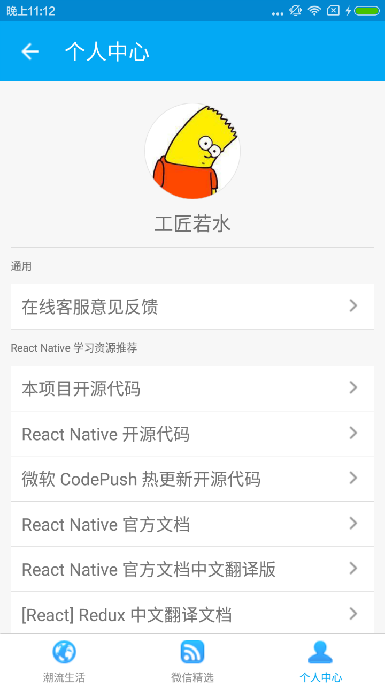
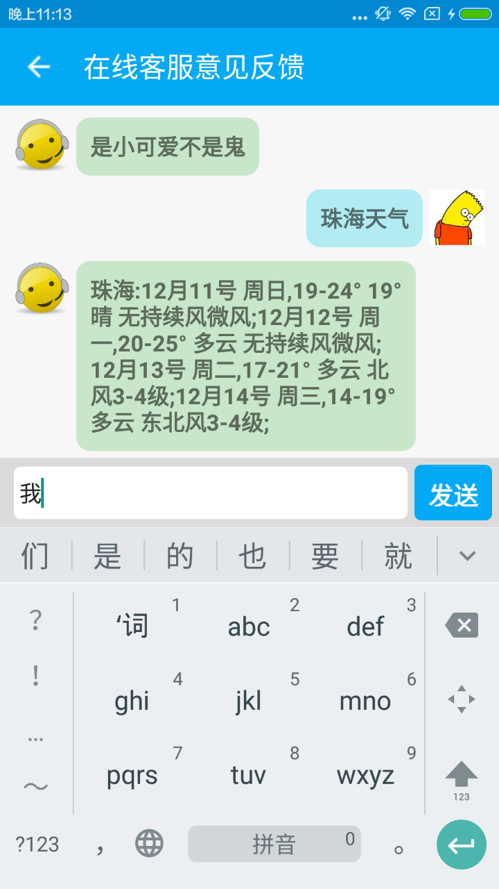

# 简介

RNPolymerPo 是一个基于 [React Native](https://github.com/facebook/react-native) 的生活类聚合实战项目，目前由于没有 MAC 设备，所以没有适配 iOS，感兴趣的可以自行适配 app 目录下相关 JS 代码即可。

<div>
    <div style="display:inline;"></div>
    <div style="display:inline;"></div> 
</div>
<div>
    <div style="display:inline;"></div>
    <div style="display:inline;"></div> 
</div>
<div>
    <div style="display:inline;"></div>
    <div style="display:inline;"></div> 
</div> 

# 获取代码与编译调试打包

如下所有步骤及说明均为 React Native Android 的 DIY，涉及命令均为 Ubuntu 环境，Windows 类推即可。

## 1. 获取代码及模块安装和签名配置

执行如下命令进行代码下载及模块安装：

```unix
$ git clone https://github.com/yanbober/RNPolymerPo.git
$ cd RNPolymerPo
$ npm install   //如果觉得慢可以先切换到国内 npm 镜像源再执行此命令
```

配置 Gradle 个人签名路径及属性：

```unix
//1. 把你个人的签名 my-release-key.keystore 文件（不知道如何生成请自行搜索）放到 RNPolymerPo 工程的 android/app 文件夹下。
//2. 编辑工程的 gradle.properties 文件，添加如下的代码（注意把其中的****替换为你自己相应密码）。

MYAPP_RELEASE_STORE_FILE=my-release-key.keystore
MYAPP_RELEASE_KEY_ALIAS=my-key-alias
MYAPP_RELEASE_STORE_PASSWORD=*****
MYAPP_RELEASE_KEY_PASSWORD=*****
```

## 2. 编译打包 APK 文件

编译生成在线快速调试 Debug 开发包，执行如下命令：

```unix
$ adb reverse tcp:8081 tcp:8081
$ react-native start    //开启本地 JS 服务
$ react-native run-android  //新终端的 RNPolymerPo 目录下执行
```

编译生成 release 包，执行如下命令：

```unix
$ cd android && ./gradlew assembleRelease
```

# 拓展规划

下一个版本准备做的事情：

1. 兼容性处理；
2. 夜间模式；
3. 热修复及 PHP 服务端编写；
4. 多语言切换等问题评估；

# 致谢

- 感谢[聚合数据平台](https://www.juhe.cn/)提供的免费 API 供开发者学习调用。
- 感谢[天行数据平台](http://www.tianapi.com/)提供的免费 API 供开发者学习调用。
- 感谢该项目 package.json 文件中 dependencies 所用到的所有第三方开源组件。
- 感谢西安点测网络科技有限公司[蒲公英应用内测专家平台](https://www.pgyer.com/)提供的 APP 监测及内测分发便利。